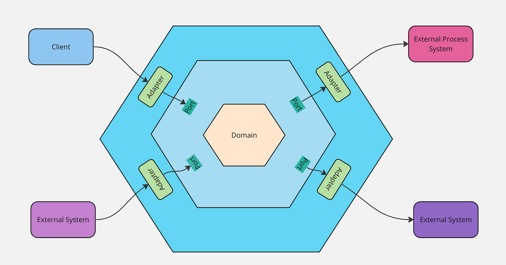
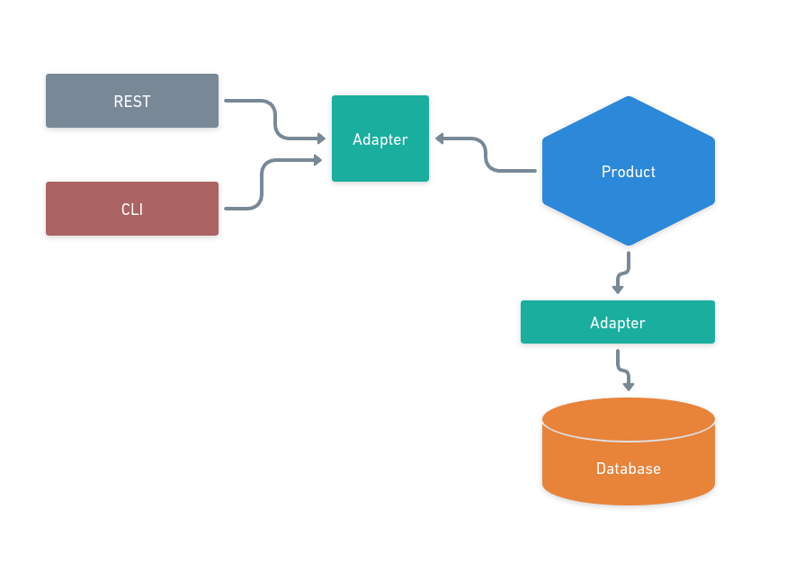

<h1 align="center"> Product - Arquitetura Hexagonal </h1>

  Projeto realizado para fixar conhecimentos relacionado a arquitetura hexagonal.

    <a href="#-motivação">Motivação</a>&nbsp;&nbsp;&nbsp;|&nbsp;&nbsp;&nbsp;
    <a href="#-tecnologias">Tecnologias</a>&nbsp;&nbsp;&nbsp;|&nbsp;&nbsp;&nbsp;
    <a href="#-projeto">Projeto</a>&nbsp;&nbsp;&nbsp;|&nbsp;&nbsp;&nbsp;
    <a href="#-funcionalidades">Funcionalidades</a>&nbsp;&nbsp;&nbsp;|&nbsp;&nbsp;&nbsp;
    <a href="#-instalação">Instalação</a>&nbsp;&nbsp;&nbsp;

 

# Modelo gráfico da distribuição dos componentes na arquitetura hexagonal

  

 

# Diagrama do projeto

  

 

## 👨‍💻 Motivação

Razões pelas quais fiz esse projeto:

- Aprender como construir uma aplicação seguindo o conceito de ports and adapter.
- Desacoplar a aplicação dos frameworks e drivers.
- Poder entender como modificar recursos que a aplicação ultiliza, causando pouco impacto.
- Compreender os traidoffs que uma arquitetura hexagonal possui.
- Consolidar os conceitos do DDD.
- Exercita a forma de desenvolvimento orientado a Testes (TDD).

 

## 🚀 Tecnologias

Esse projeto foi desenvolvido com as seguintes tecnologias:

- Node com Typescript
- Jest
- Express
- Sqlite3

Esse projeto foi desenvolvido com as seguintes Arquitetura e Patterns:

- Arquitetura Hexagonal (ports and adapters)
- DDD (Driven Domain Designer)
- TDD (Test Driven Development)
- Injeção / Inversão de Dependências
- Comunicação Rest
- Cominucação via CLI

 

## 💻 Projeto

O conceito central do projeto é direcionado para a gestão de uma entidade denominada "Produto", em torno da qual foram desenvolvidas diversas rotinas operacionais. O objetivo da arquitetura do projeto é incorporar a metodologia de "ports and adapters" (portas e adaptadores), o que proporciona uma clara separação entre a aplicação e seus recursos tanto internos quanto externos. A adoção dessa abordagem revelou-se estratégica, pois conferiu uma flexibilidade sem precedentes ao desenvolvimento. Com essa arquitetura, tornou-se notavelmente simples substituir qualquer recurso tecnológico - seja uma mudança de framework REST ou a migração de banco de dados - sem desencadear efeitos colaterais significativos na aplicação. Além disso, a aplicação foi desenhada para suportar múltiplos pontos de acesso, não se restringindo apenas a interfaces REST, mas estendendo-se também ao acesso via CLI (Interface de Linha de Comando), o que amplia sua versatilidade e facilita a integração com diferentes fluxos de trabalho.

 

## 🔥 Funcionalidades

- Cadastrar produto
- Buscar um produto pelo id
- Habilitar um produto
- Desabilitar um produto

 

## 🚩 Instalação

- Em desenvolvimento

 

## 🚧 Items que ainda estão sendo desenvolvidos

- Finalizar alguns testes